::::::::::::::::::::::::::::::::::::::: objectives

- Learn about multidimensional image data such as 3D volumetric stacks and timelapses.
- Visualize multidimensional data interactively using Napari.
- Learn to use the basic functionality of the Napari user interface including overlaying masks over
  images.
- Construct an analysis workflow to measure the properties of 3D objects in a volumetric image
  stack.
- Construct an analysis workflow to measure changes over time from a timelapse movie.

::::::::::::::::::::::::::::::::::::::::::::::::::

:::::::::::::::::::::::::::::::::::::::: questions

- How can we use scikit-image to perform image processing tasks on multidimensional image data?
- How can we visualise the results using Napari?

::::::::::::::::::::::::::::::::::::::::::::::::::

In this episode we will move beyond 2D RGB image data and learn how to process and visualise
multidimensional image data including 3D volumes and timelapse movies.

:::::::::::::::::::::::::::::::::::::::: callout

## Unofficial episode

This additional episode is not part of the official
[Carpentries Image Processing with Python Lesson](https://datacarpentry.org/image-processing/).
It was developed by
[Jeremy Pike](https://www.birmingham.ac.uk/research/arc/rsg/staff/jeremy-pike.aspx)
from the
[Research Software Group](https://www.birmingham.ac.uk/research/arc/rsg/bear-software.aspx)
and the
[Institute for Interdisciplinary Data Science and AI](https://www.birmingham.ac.uk/research/data-science/index.aspx)
at the University of Birmingham.

::::::::::::::::::::::::::::::::::::::::::::::::::

## First, import the packages needed for this episode

```python
import imageio.v3 as iio
import skimage as ski
import numpy as np
import napari
import matplotlib.pyplot as plt

%matplotlib
widget
```

## What is multidimensional image data?

Image data is often more complex than individual 2D (xy) images and can have additional
dimensionality and structure. Such multidimensional image data has many flavours
including multichannel, 3D volumes and timelapse movies. It is possible to combine these flavours to
produce higher n-dimensional data. For example a volumetric, multichannel, timelapse dataset would
have a 5D (2+1+1+1) structure.

### Multichannel image data

In many applications we can have different 2D images, or channels, of the same spatial area. We have
already seen a simple example of this in RGB colour images where we have 3 channels representing the
red, green and blue components. Another example is in fluorescence microscopy where we could have
images of different proteins. Modern techniques often allow for acquisition of more than 3 channels.

### 3D volumetric data

Volumetric image data consists of an ordered sequence of 2D images (or slices) where each slice
corresponds to a, typically evenly spaced, axial position. Such data is common in biomedical
applications for example CT or MRI where it is used to reconstruct 3D volumes of organs such as the
brain or heart.

### Timelapse movies

Timelapse movies are commonplace in everyday life. When you take a movie on your phone your acquire
an ordered sequence of 2D images (or timepoints/frames) where each image corresponds to a specific
point in time. Timelapse data is also common in scientific applications where we want to quantify
changes over time. For example imaging the growth of cell cultures, bacterial colonies or plant
roots over time.

## Interactive image visualisation with Napari

In the previous episodes we used `matplotlib.pyplot.imshow()` to display images. This is suitable
for basic visualisation of 2D multichannel image data but not well suited for more complex tasks
such as:

1. Interactive visualisation such as on-the-fly zooming in and out, rotation and toggling
   between channels.
2. Interactive image annotation. In [the *Drawing* episode](04-drawing.md) we used functions such
   as `ski.draw.rectangle()` to programmatically annotate images but not in an interactive
   user-friendly way.
3. Visualising 3D volumetric data either by toggling between slices or though a 3D rendering.
4. Visualising timelapse movies where the movie can be played and paused at specific timepoints.
5. Visualising complex higher order data (more than 3 dimensions) such as timelapse, volumetric
   multichannel images.

[Napari](https://napari.org/stable/tutorials/fundamentals/quick_start.html) is a Python library for
fast visualisation,
annotation and analysis of n-dimensional image data. At its core is the
[`napari.Viewer` class](https://napari.org/stable/api/napari.Viewer.html#napari.Viewer). Creating a
Viewer instance within a notebook will launch a Napari Graphical User Interface (GUI) wih two-way
communication between the notebook and the GUI:

```python
viewer = napari.Viewer()
```

The Napari Viewer displays data through
[Layers](https://napari.org/stable/api/napari.layers.html). There are different Layer subclasses for
different types of data. `Image` Layers are for image data and `Label` Layers are for
masks/segmentations. There are also Layer subclasses for `Points`, `Shapes`, `Surfaces` etc. Let's
load two RGB images and add them to the Viewer as `Image` Layers:

```python
colonies_01 = iio.imread(uri="data/colonies-01.tif")
colonies_02 = iio.imread(uri="data/colonies-02.tif")
viewer.add_image(data=colonies_01, name="colonies_01", rgb=True)
viewer.add_image(data=colonies_02, name="colonies_02", rgb=True)
napari.utils.nbscreenshot(viewer)
```

{alt='colonies napari ss'}

Here we use the `viewer.add_image()` function to add `Image` Layers to the Viewer. We set `rgb=True`
to display the three channel image as RGB. The `napari.utils.nbscreenshot()` function outputs a
screenshot of the Viewer to the notebook. Now lets look at some multichannel image data:

```python
cells = iio.imread(uri="data/FluorescentCells.tif")
print(cells.shape)
```

```output
(3, 474, 511)
```

Like RGB data this image of cells also has three channels (stored in the first dimension of the
NumPy array). However, in this case we may want to visualise each channel independently. To do this
we do not set `rgb=True` when adding the `Image` Layer:

```python
viewer.layers.clear()
viewer.add_image(data=cells, name="cells")
```

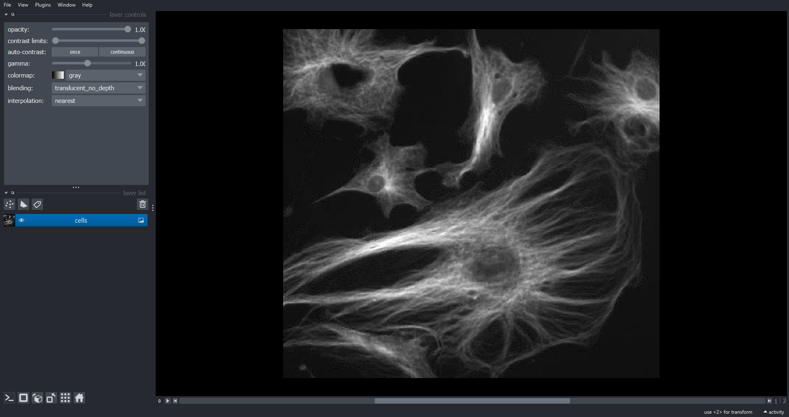{alt='cells napari ss'}

:::::::::::::::::::::::::::::::::::::::: callout

## Clearing the Napari Viewer

When we want to close all Layers in a Viewer instance we can use `viewer.layers.clear()`. This
allows us to start fresh, alternatively we could close the existing Viewer and open a new one with
`viewer = napari.Viewer()`. We will use the first approach throughout this Episode but if any point
you accidentally close the Viewer you can just open a new one.

::::::::::::::::::::::::::::::::::::::::::::::::::

We can now scroll through the channels within Napari using the slider just below the image. This
approach will work with an arbitrary number of channels, not just three. With multichannel data it
is common to visualise colour overlays of selected channels where each channel has a different
colour map. In Napari we can do this programmatically using the `channel_axis` variable:

```python
viewer.layers.clear()
viewer.add_image(data=cells, name=["membrane", "cytoplasm", "nucleus"], channel_axis=0)
```

{alt='cells seperate napari ss'}

Using what we have learnt in the previous Episodes lets segment the nuclei . First we produce a
binary mask of the nuclei by blurring the nuclei channel image and thresholding with the Otsu
approach. Subsequently, we label the connected components within the mask to indentify individual
nuclei:

```python
blurred_nuclei = ski.filters.gaussian(cells[2], sigma=2.0)
t = ski.filters.threshold_otsu(blurred_nuclei)
nuclei_mask = blurred_nuclei > t
nuclei_labels = ski.measure.label(nuclei_mask, connectivity=2, return_num=False)
```

Now lets display the nuclei channel and overlay the labels within Napari using a `Label` layer:

```python
viewer.layers.clear()
viewer.add_image(data=cells[2], name="nuclei")
viewer.add_labels(data=nuclei_labels, name="nuclei_labels")
```

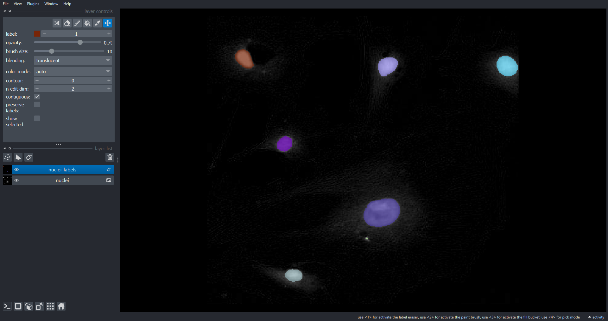{alt='nuclei napari ss'}

We can also interactively annotate images with shapes using a `Shapes` Layer. Let's display all
three channels and then do this within the GUI:

```python
viewer.layers.clear()
viewer.add_image(data=cells, name="cells")
# the instructor will demonstrate how to add a `Shapes` Layer and draw around cells using polygons
```

{alt='shapes napari ss'}

:::::::::::::::::::::::::::::::::::::::  challenge

## Using Napari as an image viewer (20 min)

In [the *Capstone challenge* episode](09-challenges.md) you made a function to count the number of
bacteria colonies in an image also producing a new image that highlights the colonies. Modify this
function to make use of Napari, as opposed to `Matplotlib`, to display both the original colony
image
and the segmented individual colonies. Test this new function on `"data/colonies-03.tif"`. If you
did not complete the *Capstone challenge* epsidode you
can start with function from the
[solution](09-challenges.md#colony-counting-with-minimum-size-and-automated-threshold-optional-not-included-in-timing).
Hints:

1. A `napari.Viewer` object should be parsed to the function as an input parameter.
2. The original image should be added to the Viewer as an `Image` Layer.
3. The labelled colony image should be to the Viewer as an `Label` Layer.

:::::::::::::::::::::::::::::::::::::::  solution

Your new function might look something like this:

```python
def count_colonies_napari(image_filename, viewer, sigma=1.0, min_colony_size=10, connectivity=2):
  bacteria_image = iio.imread(image_filename)
  gray_bacteria = ski.color.rgb2gray(bacteria_image)
  blurred_image = ski.filters.gaussian(gray_bacteria, sigma=sigma)

  # create mask excluding the very bright pixels outside the dish
  # we dont want to include these when calculating the automated threshold
  mask = blurred_image < 0.90
  # calculate an automated threshold value within the dish using the Otsu method
  t = ski.filters.threshold_otsu(blurred_image[mask])
  # update mask to select pixels both within the dish and less than t
  mask = np.logical_and(mask, blurred_image < t)
  # remove objects smaller than specified area
  mask = ski.morphology.remove_small_objects(mask, min_size=min_colony_size)

  labeled_image, count = ski.measure.label(mask, return_num=True)
  print(f"There are {count} colonies in {image_filename}")

  # add the orginal image (RGB) to the Napari Viewer
  viewer.add_image(data=bacteria_image, name="bacteria", rgb=True)
  # add the labeled image to the Napari Viewer
  viewer.add_labels(data=labeled_image, name="colony masks")
```

To run this function on `"data/colonies-03.tif"`:

```python
viewer.layers.clear()  # or viewer = napari.Viewer() if you want a new Viewer
count_colonies_napari(image_filename="data/colonies-03.tif", viewer=viewer)
```

```output
There are 260 colonies in data/colonies-03.tif
```

{alt='colonies napari 3 ss'}

:::::::::::::::::::::::::

::::::::::::::::::::::::::::::::::::::::::::::::::

:::::::::::::::::::::::::::::::::::::::  challenge

## Learning to use the Napari GUI (optional, not included in timing)

Take some time to further familiarize yourself with the Napari GUI. You could load some of the
course images and experiment with different features, or alternatively you could take a look at the
official [Viewer tutorial](https://napari.org/stable/tutorials/fundamentals/viewer.html).

::::::::::::::::::::::::::::::::::::::::::::::::::

::::::::::::::::::::::::::::::::::::::::  callout

## Napari plugins

[Plugins](https://napari.org/stable/plugins/index.html) extend Napari's core functionally and
allow you to add lots of cool and advanced features. There is an ever-increasing number of Napari
plugins which are available from the [Napari hub](https://www.napari-hub.org/). For example:

- [napari-animation](https://www.napari-hub.org/plugins/napari-animation) for making video
  annotations with key frames.
- [napari-segment-blobs-and-things-with-membranes](https://www.napari-hub.org/plugins/napari-segment-blobs-and-things-with-membranes)
  for adding common image processing operations to the Tools menu.
- [napari-skimage-regionprops](https://www.napari-hub.org/plugins/napari-skimage-regionprops) for
  measuring the properties of connected components from `Label` Layers.
- [napari-pyclesperanto-assistant](https://www.napari-hub.org/plugins/napari-pyclesperanto-assistant)
  for GPU-accelerated image processing operations.
- [napari-clusters-plotter](https://www.napari-hub.org/plugins/napari-clusters-plotter) for
  clustering objects according to their properties including dimensionality reduction techniques
  like PCA and UMAP.
- [napari-acceleration-pixel-and-object-classification](https://www.napari-hub.org/plugins/napari-accelerated-pixel-and-object-classification)
  for Random Forest-based pixel and object classification.
- [cellpose-napari](https://www.napari-hub.org/plugins/cellpose-napari)
  and [stardist-napari](https://www.napari-hub.org/plugins/stardist-napari) for pretrained deep
  learning-based models to segment cells and nuclei.
- [napari-n2v](https://www.napari-hub.org/plugins/napari-n2v) for self-supervised deep
  learning-based denosing.
- [napari-assistant](https://www.napari-hub.org/plugins/napari-assistant), a meta-plugin for
  building image processing workflows.

::::::::::::::::::::::::::::::::::::::::::::::::::

::::::::::::::::::::::::::::::::::::::::  callout

## Getting help on image.sc

[image.sc](https://forum.image.sc/) is a community forum for all software-oriented aspects of
scientific imaging, particularly (but not limited to) image analysis, processing, acquisition,
storage, and management. Its great place to get help and ask questions which are either general or
specific to a particular tool. There are active sections
for [python](https://forum.image.sc/tag/python), [scikit-image](https://forum.image.sc/tag/scikit-image)
and [Napari](https://forum.image.sc/tag/napari).

::::::::::::::::::::::::::::::::::::::::::::::::::

## Processing 3D volumetric data

Recall that 3D volumetric data consists of an ordered sequence of images, or slices, each
corresponding to a specific axial position. As an example lets work with
`skimage.data.cells3d()`which is a 3D fluorescence microscopy image stack. From
the [dataset documentation](https://scikit-image.org/docs/stable/api/skimage.data.html#skimage.data.cells3d)
we can see that the data has two channels (0: membrane, 1: nuclei). The dimensions are ordered
`(z, channels, y, x)` and each voxel has a size of `(0.29 0.26 0.26)` microns. A voxel is the 3D
equivalent of a pixel and the size specifies
the physical dimensions, in `(z, y, x)` order for this example. Note the size of the voxels in z (
axial) is larger than the voxel spacing in the xy dimensions (lateral). Let's load the data and
visualise with Napari:

```python
cells3d = ski.data.cells3d()
viewer.layers.clear()
viewer.add_image(data=cells3d, name=["membrane", "nucleus"], channel_axis=1)
print(cells3d.shape)
```

```output
(60, 2, 256, 256)
```

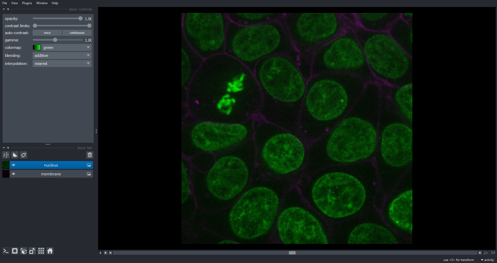{alt='cell3d slice napari ss'}

Note we now have a dimension slice to control which slice we are visualizing. You can also switch
to a 3D rendering of the data:

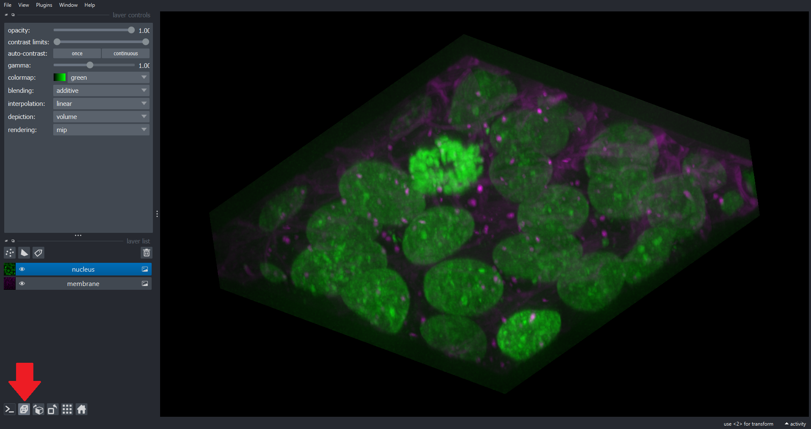{alt='cell3d volume napari ss'}

Many of the scikit-image functions you have used throughout this Lesson work with 3D (or indeed nD)
image data. For example lets blur the nuclei channel using a 3D Gaussian filter and add the result
as a `Image` Layer to the Viewer:

```python
# extract the nuclei channel
nuclei = cells3d[:, 1, :, :]
# store the voxel size as a NumPy array (in microns)
voxel_size = np.array([0.29, 0.26, 0.26])
# get sigma (std) values for each dimension that corresponds to 0.5 microns
sigma = 0.5 / voxel_size
# blur data with 3D Guassian filter
blurred_nuclei = ski.filters.gaussian(nuclei, sigma=sigma)
# add to Napari Viewer
viewer.add_image(data=blurred_nuclei, name="nucleus_blurred")
print(sigma)
```

```output
[1.72413793 1.92307692 1.92307692]
```

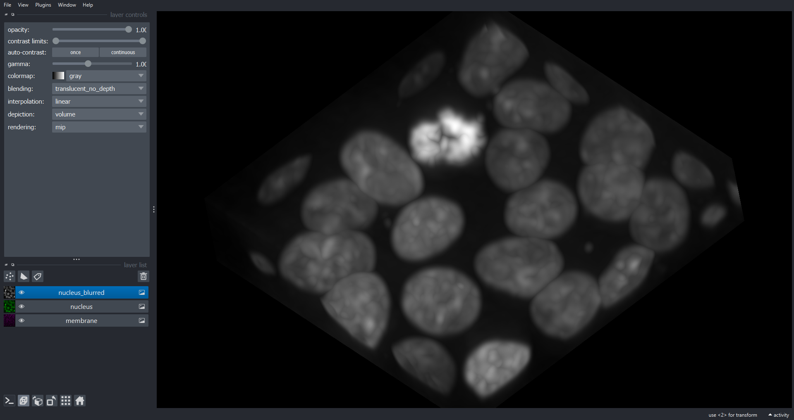{alt='cell3d volume napari ss'}

Note we have used a different sigma for each dimension which corresponds to 0.5 microns in real
space.

:::::::::::::::::::::::::::::::::::::::  challenge

## Segmenting objects in 3D (25 min)

Write a workflow which:

1. Segments the nuclei within `skimage.data.cells3d()` to produce a 3D labelled volume.
2. Add the 3D labelled volume to a Napari Viewer as a `Label` Layer.
3. Calculate the mean volume in microns^3 of all distinct objects (connected components) in your 3D
   labelled
   volume.

You will need to recall concepts from the [*Thresholding*](07-thresholding.md) and the [*Connected
Components Analysis*](08-connected-components.md) episodes. Hints:

- The 3D blurred nuclei volume we have just calculated makes a good starting point.
- `ski.morphology.remove_small_objects()` is useful for removing small objects in masks. In 3D
  the `min_size` parameter specifies the minimum number of voxels a connected component should
  contain.
- In 3D we typically use `connectivity=3` (as opposed to `connectivity=2` for 2D data).
- `ski.measure.regionprops()` can be used to calulate the properties of connected components in 3D.
  The returned `"area"` property gives the volume of each object in voxels.

:::::::::::::::::::::::::::::::::::::::  solution

Starting with the 3D blurred nuclei volume as our starting point here is one potential solution
that will segment the nuclei and add to the existing Napari Viewer:

```python
# use an automated Otsu threshold to produce a binary mask of the nuceli
t = ski.filters.threshold_otsu(blurred_nuclei)
nuclei_mask = blurred_nuclei > t
# remove objects from the mask smaller than 5 microns^3
# np.prod(voxel_size) returns the volume of a voxel in microns^3
min_size = 5 / np.prod(voxel_size)
nuclei_mask = ski.morphology.remove_small_objects(nuclei_mask, min_size=min_size, connectivity=3)
# label 3D connected components
# we specify connectivity=3 but this is the default behaviour for 3D data
nuclei_labels = ski.measure.label(nuclei_mask, connectivity=3, return_num=False)
# add to Napari Viewer
viewer.add_labels(data=nuclei_labels, name="nuclei_labels")
```

{alt='cell3d labels napari ss'}

To extract the properties of the connected components we can use `ski.measure.regionprops()`:

```python
props = ski.measure.regionprops(nuclei_labels)
# get the cell volumes in pixels as a NumPy array
cell_volumes_voxels = np.array([objf["area"] for objf in props])
# get the mean and convert to microns^3
cell_volumes_mean = np.mean(cell_volumes_voxels) * np.prod(voxel_size)
f"There are {len(cell_volumes_voxels)} distinct objects with a mean volume of {cell_volumes_mean} microns^3"
```

```output
'There are 18 distinct objects with a mean volume of 784.6577237777778 microns^3'
```

:::::::::::::::::::::::::

::::::::::::::::::::::::::::::::::::::::::::::::::

:::::::::::::::::::::::::::::::::::::::  challenge

## Intensity morphometrics (optional, not included in timing)

It is common to want to retrieve properties of connected components which use the pixel intensities
from the original data. For example the mean, max, min or sum pixel intensity within each object.
Modify your solution from the previous exercise to also retrieve the mean intensity of the original
nuclei channel within each connected component. You may need to refer to
the `ski.measure.regionprops()` [documentation](https://scikit-image.org/docs/stable/api/skimage.measure.html#skimage.measure.regionprops).

:::::::::::::::::::::::::::::::::::::::  solution

```python
props = ski.measure.regionprops(nuclei_labels, intensity_image=nuclei)
# get the cell volumes in pixels as a NumPy array
cell_volumes_pixels = np.array([objf["area"] for objf in props])
# get the mean and convert to microns^3
cell_volumes_mean = np.mean(cell_volumes_pixels) * np.prod(voxel_size)
# mean intensity within each object
cell_mean_intensities = np.array([objf["intensity_mean"] for objf in props])
f"There are {len(cell_volumes_pixels)} distinct objects with a mean volume of {cell_volumes_mean} microns^3 and a mean intensity of {np.mean(cell_mean_intensities)}"
```

```output
'There are 18 distinct objects with a mean volume of 784.6577237777778 microns^3 and a mean intensity of 13876.25671914064'
```

:::::::::::::::::::::::::

::::::::::::::::::::::::::::::::::::::::::::::::::

## Processing timelapse movies

Timelapse data consists of an ordered series of images, or frames, where each image corresponds to a
specific point in time. `data/cell_timelapse.tif` is a timelapse fluorescence microscopy movie of
cell nuclei with 41 timepoints. There are two cells at the beginning of the timelapse which both
divide, via a process
called mitosis, leaving fours cells at the end. Let's load the data and visualise with Napari:

```python
cell_timelapse = iio.imread(uri="data/cell_timelapse.tif")
viewer.layers.clear()
viewer.add_image(data=cell_timelapse, name="timelapse")
print(cell_timelapse.shape)
```

```output
(41, 113, 101)
```

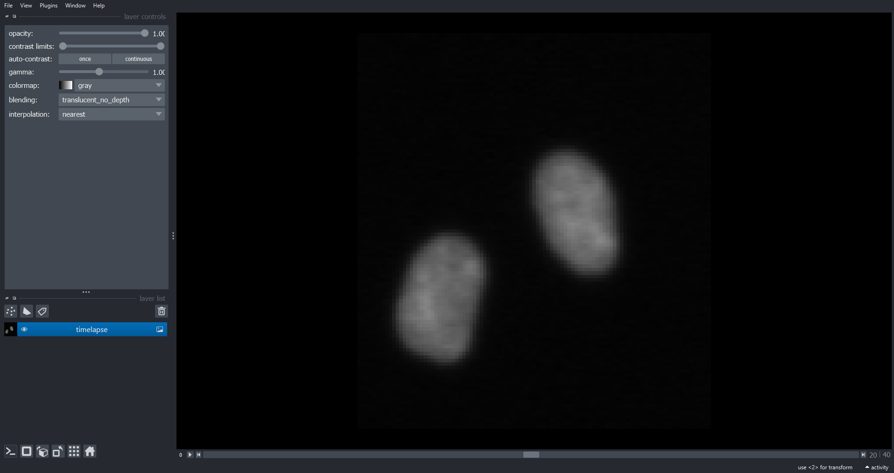{alt='cell timelapse napari ss'}

Note there is a dimension slider to navigate between timepoints and a playback button to play/pause
the movie. When analysing timelapse data we can use our now familiar image processing functions from
scikit-image. However, unlike volumetric data it is often appropriate to analyse each timepoint
separately as 2D images rather than performing operations on the 3D NumPy array. To do this we can
use a loop to iterate through timepoints. For example lets calculate the mean intensity of each
frame in the timelapse and plot the results:

```python
# empty list to store frame intensitys
mean_intensities = []
# loop through frames 
# enumerate gives convenient access to both the frame index and the frame
for frame_index, frame in enumerate(cell_timelapse):
  frame_mean = np.mean(frame)
  # add frame mean to list
  mean_intensities.append(frame_mean)

fig, ax = plt.subplots()
plt.plot(mean_intensities)
plt.xlabel("Timepoint")
plt.ylabel("Mean frame intensity")
```

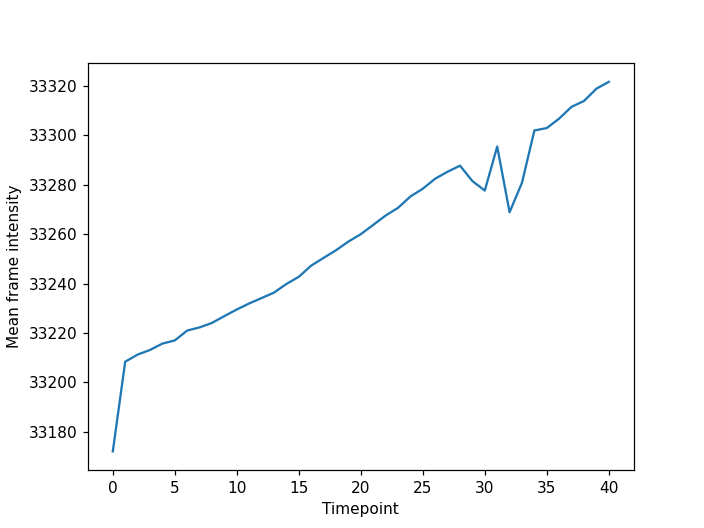{alt='cell timelapse mean plot ss'}

We can see that the frame intensity trends up throughout the movie with dips around timepoint
thirty which if you look corresponds to when the cell divisions are occurring.

:::::::::::::::::::::::::::::::::::::::  challenge

## Calculating nuclear area over time (25 min)

Create a binary mask (3D boolean NumPy array) segmenting the nuclei in `data/cell_timelapse.tif`
over time and add this mask to the Napari Viewer. You do not need to indentify/label individual
objects/nuclei. Record the total area of the nuclei in each frame over time and plot the results.
Hints:

- Use a for loop to iterate through timepoints so you can process each frame separately.
- You may find it useful to create a NumPy
  array for the binary mask (`mask = np.zeros(cell_timelapse.shape, dtype=bool)`). This array should
  be created outside the loop and filled in within it.

:::::::::::::::::::::::::::::::::::::::  solution

Here is one potential solution:

```python
# empty list for nuclear areas
nuclear_areas = []
# boolean mask for nuclear mask
# same shape as original timelapse
mask = np.zeros(cell_timelapse.shape, dtype=bool)

# iterate through timepoints
for frame_index, frame in enumerate(cell_timelapse):
  # blur the frame to reduce noise
  blurred_frame = ski.filters.gaussian(frame, sigma=1)
  # threshold with an Otsu approach
  t = ski.filters.threshold_otsu(blurred_frame)
  frame_mask = blurred_frame > t
  # fill in the corresponding frame of our global mask
  mask[frame_index] = frame_mask
  # append the area of the mask for this frame (the sum)
  nuclear_areas.append(np.sum(frame_mask))

# add mask to Napari Viewer
viewer.add_labels(data=mask, name="nuclear mask")

# plot the nuclear area over time
fig, ax = plt.subplots()
plt.plot(nuclear_areas)
plt.xlabel("Timepoint")
plt.ylabel("Total nuclear area")
```

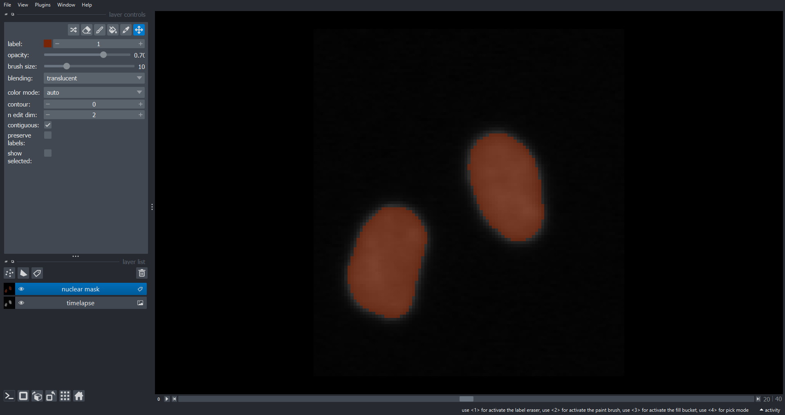{alt='cell timelapse mask napari ss'}

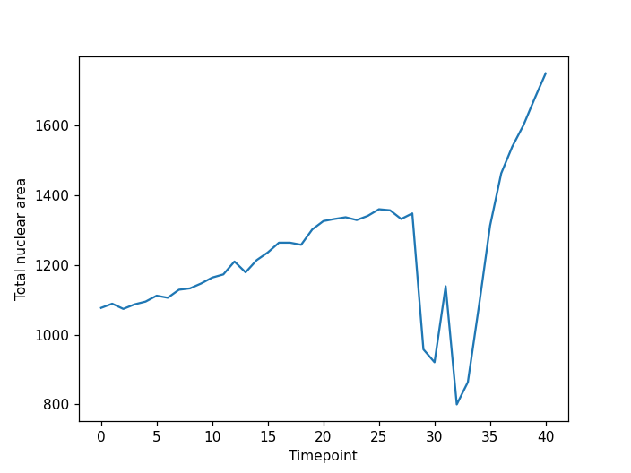{alt='cell timelapse area plot ss'}

Note the two large drops in area around timepoint thirty corresponding the division events.

:::::::::::::::::::::::::

::::::::::::::::::::::::::::::::::::::::::::::::::

:::::::::::::::::::::::::::::::::::::::  challenge

## Tracking objects over time (optional, not included in timing)

Tracking is the process of following the trajectories of individual objects as they move over time.
A simple approach to tracking is to find connected components in a timelapse treating the data
as a 3D volume. This works well if the objects in question are well separated and do not move
sufficiently far between timepoints to break the connectivity of the 3D (2D + time) connected
component. Implement this approach for `data/cell_timelapse.tif` and plot the area of each
object/nucleus as it changes over time. How well does this approach work? Do you think it would be
sufficient for more complex data?

:::::::::::::::::::::::::::::::::::::::  solution

Here is a potential solution:

```python
# boolean mask for nuclear mask
# same shape as original timelapse
mask = np.zeros(cell_timelapse.shape, dtype=bool)
mask = np.zeros(cell_timelapse.shape, dtype=bool)

# iterate through timepoints
for time_index, frame in enumerate(cell_timelapse):
  # blur the frame to reduce noise
  blurred_frame = ski.filters.gaussian(frame, sigma=1)
  # threshold with an Otsu approach
  t = ski.filters.threshold_otsu(blurred_frame)
  frame_mask = blurred_frame > t
  # fill in the corresponding frame of our global mask
  mask[time_index] = frame_mask

# find the objects (connected components) in the 3D (2D + time) mask
labeled_mask, num_ccs = ski.measure.label(mask, connectivity=3, return_num=True)
# add labeled objects to Napari Viewer 
viewer.add_labels(data=labeled_mask, name="labeled_mask")

# plot for area of each object over time
fig, ax = plt.subplots()
plt.xlabel("Timepoint")
plt.ylabel("Nuclear area")
# iterate through objects
for label_index in range(num_ccs):
  # empty list for area of this object (nucelus) over time
  nuclear_area = []
  # iterate through timepoints and retrieve object areas
  for time_index, frame in enumerate(labeled_mask):
    nuclear_area.append(np.sum(frame == label_index + 1))
  # add line to plot for this object (nucelus)
  plt.plot(nuclear_area)
```

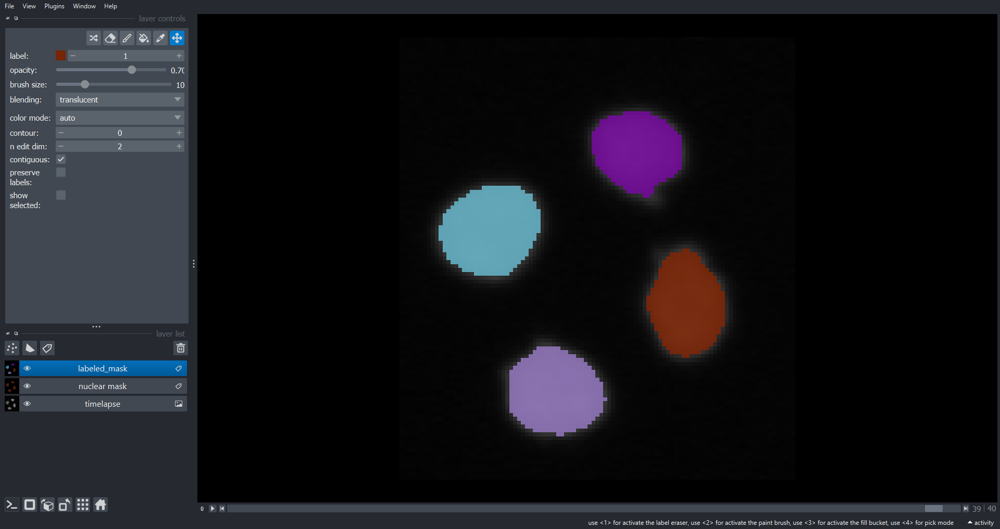{alt='cell timelapse tracking napari ss'}

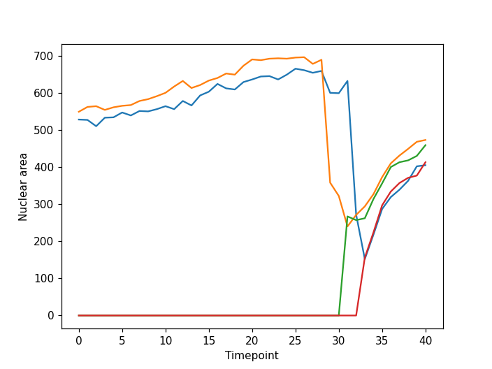{alt='cell timelapse tracking plot ss'}

From the plot we can see our approach has worked well for this simple example. The movie starts with
two nuclei which undergo division such that we have four nuclei at the end of the timelapse. However, for more complex data our simple tracking approach is likely to fail. If you are interested in tracking a good starting point could be a Napari plugin such as [btrack](https://www.napari-hub.org/plugins/btrack) which uses a Bayesian approach to track multiple objects in crowded fields of views.

:::::::::::::::::::::::::

::::::::::::::::::::::::::::::::::::::::::::::::::

:::::::::::::::::::::::::::::::::::::::: keypoints

- We can access open a Napari n-dimensional image viewer with `viewer = napari.Viewer()`.
- `Image` and `Label` Layers can be added to a viewer with `viewer.add_image()`
  and `viewer.add_labels()` respectively.
- Many scikit-image functions such as `ski.filters.gaussian()`, `ski.threshold.threshold_otsu()`,
  `ski.measure.label()` and `ski.measure.regionprops()` work with 3D image data.
- We can iterate through time-points to analyse timelapse movies.

::::::::::::::::::::::::::::::::::::::::::::::::::
